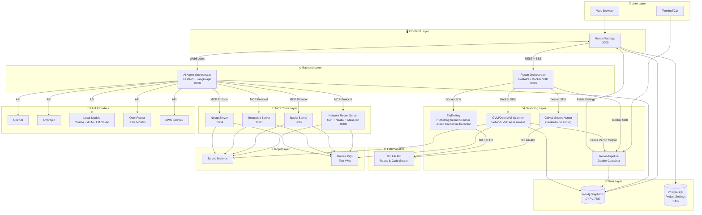
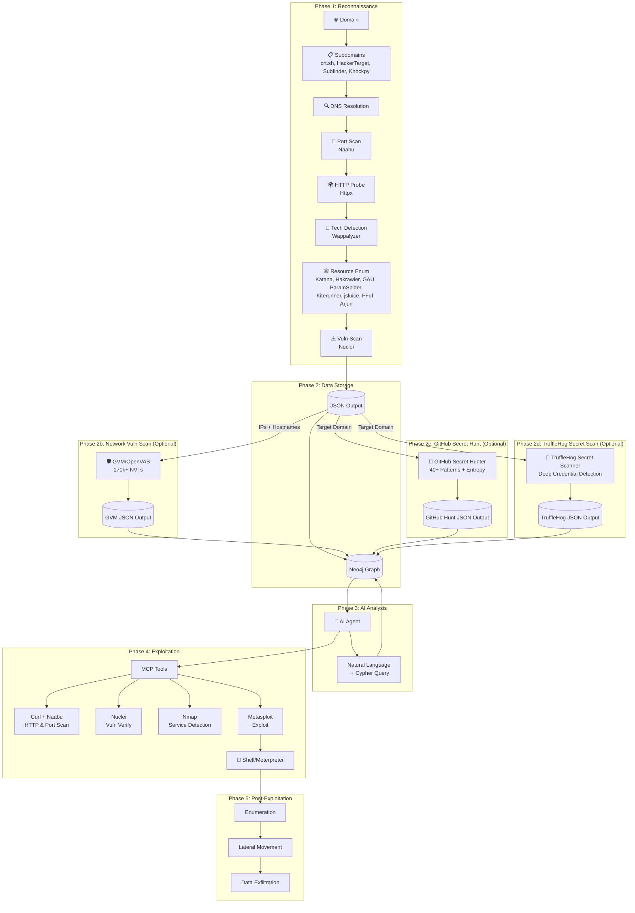
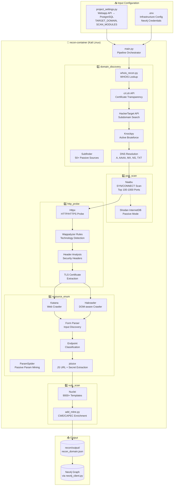

# System Architecture

## High-Level Architecture

```mermaid
flowchart TB
    subgraph User["👤 User Layer"]
        Browser[Web Browser]
        CLI[Terminal/CLI]
    end

    subgraph Frontend["🖥️ Frontend Layer"]
        Webapp[Next.js Webapp<br/>:3000]
    end

    subgraph Backend["⚙️ Backend Layer"]
        Agent[AI Agent Orchestrator<br/>FastAPI + LangGraph<br/>:8090]
        ReconOrch[Recon Orchestrator<br/>FastAPI + Docker SDK<br/>:8010]
    end

    subgraph Tools["🔧 MCP Tools Layer"]
        NetworkRecon[Network Recon Server<br/>Curl + Naabu + Masscan<br/>:8000]
        Nuclei[Nuclei Server<br/>:8002]
        Metasploit[Metasploit Server<br/>:8003]
        Nmap[Nmap Server<br/>:8004]
    end

    subgraph Scanning["🔍 Scanning Layer"]
        Recon[Recon Pipeline<br/>Docker Container]
        GVM[GVM/OpenVAS Scanner<br/>Network Vuln Assessment]
        GHHunt[GitHub Secret Hunter<br/>Credential Scanning]
        TruffleHog[TruffleHog<br/>TruffleHog Secret Scanner - Deep Credential Detection]
    end

    subgraph Data["💾 Data Layer"]
        Neo4j[(Neo4j Graph DB<br/>:7474/:7687)]
        Postgres[(PostgreSQL<br/>Project Settings<br/>:5432)]
    end

    subgraph LLMProviders["🧠 LLM Providers"]
        OpenAI[OpenAI]
        Anthropic[Anthropic]
        LocalLLM[Local Models<br/>Ollama · vLLM · LM Studio]
        OpenRouter[OpenRouter<br/>300+ Models]
        Bedrock[AWS Bedrock]
    end

    subgraph External["🌐 External APIs"]
        GitHubAPI[GitHub API<br/>Repos & Code Search]
    end

    subgraph Targets["🎯 Target Layer"]
        Target[Target Systems]
        GuineaPigs[Guinea Pigs<br/>Test VMs]
    end

    Browser --> Webapp
    CLI --> Recon
    Webapp <-->|WebSocket| Agent
    Webapp -->|REST + SSE| ReconOrch
    Webapp --> Neo4j
    Webapp --> Postgres
    ReconOrch -->|Docker SDK| Recon
    ReconOrch -->|Docker SDK| GVM
    ReconOrch -->|Docker SDK| GHHunt
    ReconOrch -->|Docker SDK| TruffleHog
    Recon -->|Fetch Settings| Webapp
    GHHunt -->|GitHub API| GitHubAPI
    TruffleHog -->|GitHub API| GitHubAPI
    Agent -->|API| OpenAI
    Agent -->|API| Anthropic
    Agent -->|API| LocalLLM
    Agent -->|API| OpenRouter
    Agent -->|API| Bedrock
    Agent --> Neo4j
    Agent -->|MCP Protocol| NetworkRecon
    Agent -->|MCP Protocol| Nuclei
    Agent -->|MCP Protocol| Metasploit
    Agent -->|MCP Protocol| Nmap
    Recon --> Neo4j
    GVM -->|Reads Recon Output| Recon
    GVM --> Neo4j
    GVM --> Target
    GVM --> GuineaPigs
    NetworkRecon --> Target
    Nuclei --> Target
    Metasploit --> Target
    Nmap --> Target
    NetworkRecon --> GuineaPigs
    Nuclei --> GuineaPigs
    Metasploit --> GuineaPigs
    Nmap --> GuineaPigs
```

## Data Flow Pipeline

```mermaid
flowchart TB
    subgraph Phase1["Phase 1: Reconnaissance"]
        Domain[🌐 Domain] --> Subdomains[📋 Subdomains<br/>crt.sh, HackerTarget, Subfinder, Knockpy]
        Subdomains --> DNS[🔍 DNS Resolution]
        DNS --> Ports[🔌 Port Scan<br/>Naabu]
        Ports --> HTTP[🌍 HTTP Probe<br/>Httpx]
        HTTP --> Tech[🔧 Tech Detection<br/>Wappalyzer]
        Tech --> Resources[🕸️ Resource Enum<br/>Katana, Hakrawler, GAU, ParamSpider,<br/>Kiterunner, jsluice, FFuf, Arjun]
        Resources --> Vulns[⚠️ Vuln Scan<br/>Nuclei]
    end

    subgraph Phase2["Phase 2: Data Storage"]
        Vulns --> JSON[(JSON Output)]
        JSON --> Graph[(Neo4j Graph)]
    end

    subgraph Phase2b["Phase 2b: Network Vuln Scan (Optional)"]
        JSON -->|IPs + Hostnames| GVM[🛡️ GVM/OpenVAS<br/>170k+ NVTs]
        GVM --> GVMResults[(GVM JSON Output)]
        GVMResults --> Graph
    end

    subgraph Phase2c["Phase 2c: GitHub Secret Hunt (Optional)"]
        JSON -->|Target Domain| GHHunt[🔑 GitHub Secret Hunter<br/>40+ Patterns + Entropy]
        GHHunt --> GHResults[(GitHub Hunt JSON Output)]
        GHResults --> Graph
    end

    subgraph Phase2d["Phase 2d: TruffleHog Secret Scan (Optional)"]
        JSON -->|Target Domain| TruffleHog[🔐 TruffleHog Secret Scanner<br/>Deep Credential Detection]
        TruffleHog --> THResults[(TruffleHog JSON Output)]
        THResults --> Graph
    end

    subgraph Phase3["Phase 3: AI Analysis"]
        Graph --> Agent[🤖 AI Agent]
        Agent --> Query[Natural Language<br/>→ Cypher Query]
        Query --> Graph
    end

    subgraph Phase4["Phase 4: Exploitation"]
        Agent --> MCP[MCP Tools]
        MCP --> NetworkRecon2[Curl + Naabu<br/>HTTP & Port Scan]
        MCP --> Nuclei2[Nuclei<br/>Vuln Verify]
        MCP --> Nmap2[Nmap<br/>Service Detection]
        MCP --> MSF[Metasploit<br/>Exploit]
        MSF --> Shell[🐚 Shell/Meterpreter]
    end

    subgraph Phase5["Phase 5: Post-Exploitation"]
        Shell --> Enum[Enumeration]
        Enum --> Pivot[Lateral Movement]
        Pivot --> Exfil[Data Exfiltration]
    end
```

## Recon Pipeline Detail

```mermaid
flowchart TB
    subgraph Input["📥 Input Configuration"]
        Params[project_settings.py<br/>Webapp API → PostgreSQL<br/>TARGET_DOMAIN, SCAN_MODULES]
        Env[.env<br/>Infrastructure Config<br/>Neo4j Credentials]
    end

    subgraph Container["🐳 recon-container (Kali Linux)"]
        Main[main.py<br/>Pipeline Orchestrator]

        subgraph Module1["1️⃣ domain_discovery"]
            WHOIS[whois_recon.py<br/>WHOIS Lookup]
            CRT[crt.sh API<br/>Certificate Transparency]
            HT[HackerTarget API<br/>Subdomain Search]
            SF[Subfinder<br/>50+ Passive Sources]
            Knock[Knockpy<br/>Active Bruteforce]
            DNS[DNS Resolution<br/>A, AAAA, MX, NS, TXT]
        end

        subgraph Module2["2️⃣ port_scan"]
            Naabu[Naabu<br/>SYN/CONNECT Scan<br/>Top 100-1000 Ports]
            Shodan[Shodan InternetDB<br/>Passive Mode]
        end

        subgraph Module3["3️⃣ http_probe"]
            Httpx[Httpx<br/>HTTP/HTTPS Probe]
            Tech[Wappalyzer Rules<br/>Technology Detection]
            Headers[Header Analysis<br/>Security Headers]
            Certs[TLS Certificate<br/>Extraction]
        end

        subgraph Module4["4️⃣ resource_enum"]
            Katana[Katana<br/>Web Crawler]
            Hakrawler[Hakrawler<br/>DOM-aware Crawler]
            ParamSpider[ParamSpider<br/>Passive Param Mining]
            Forms[Form Parser<br/>Input Discovery]
            Endpoints[Endpoint<br/>Classification]
            Jsluice[jsluice<br/>JS URL + Secret Extraction]
        end

        subgraph Module5["5️⃣ vuln_scan"]
            Nuclei[Nuclei<br/>9000+ Templates]
            MITRE[add_mitre.py<br/>CWE/CAPEC Enrichment]
        end
    end

    subgraph Output["📤 Output"]
        JSON[(recon/output/<br/>recon_domain.json)]
        Graph[(Neo4j Graph<br/>via neo4j_client.py)]
    end

    Params --> Main
    Env --> Main

    Main --> WHOIS
    WHOIS --> CRT
    CRT --> HT
    HT --> Knock
    Knock --> DNS

    DNS --> Naabu
    Naabu -.-> Shodan

    Naabu --> Httpx
    Httpx --> Tech
    Tech --> Headers
    Headers --> Certs

    Certs --> Katana
    Certs --> Hakrawler
    Katana --> Forms
    Hakrawler --> Forms
    Forms --> Endpoints
    Endpoints --> Jsluice

    Jsluice --> Nuclei
    Nuclei --> MITRE

    MITRE --> JSON
    JSON --> Graph
```