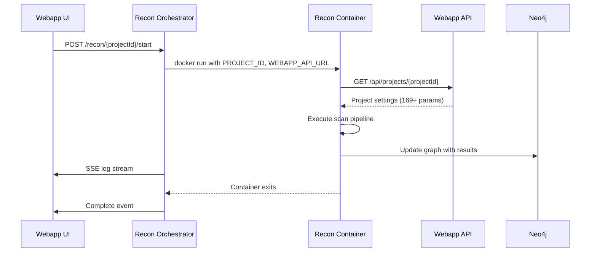
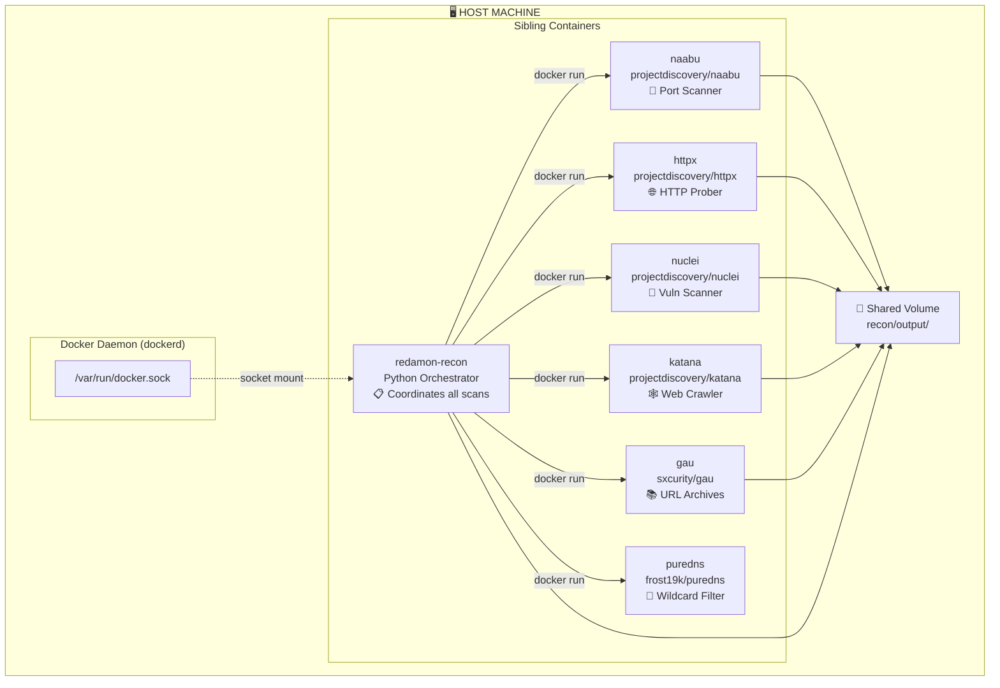

# LAAL - LLM-Augmented Autonomous Attack Lifecycle

An autonomous AI framework that chains reconnaissance, exploitation, and post-exploitation into a single pipeline.

## 🚀 How to Run

### Docker Mode
This is the easiest way as it handles all dependencies (Subfinder, Naabu, Httpx, Nuclei) automatically.

```bash
# Run one-off scan with arguments
docker-compose run recon --domain example.com
```


### Orchestrator Communication Flow




## 🏗️ Docker-in-Docker Architecture

The recon module uses a **Docker-in-Docker (DinD)** pattern where the main recon container orchestrates sibling containers for each scanning tool.

### How It Works

The recon container shares the **host's Docker daemon** via a socket mount, meaning all containers are **siblings** managed by the same host Docker daemon.




## 📂 Results
All findings are saved in the `recon/output/` directory as `recon_default_project.json`. 

## Tool Integration
Install and configure the following tools in the recon image:
*   **Discovery**: `subfinder`, `amass`, `knockpy`, `puredns`.
*   **Port Scanning**: `naabu`.
*   **HTTP Probing**: `httpx`, `wappalyzer`.
*   **Crawling**: `katana`, `hakrawler`, `gau`, `paramspider`.
*   **Vulnerability Scanning**: `nuclei` (with 9,000+ templates).
